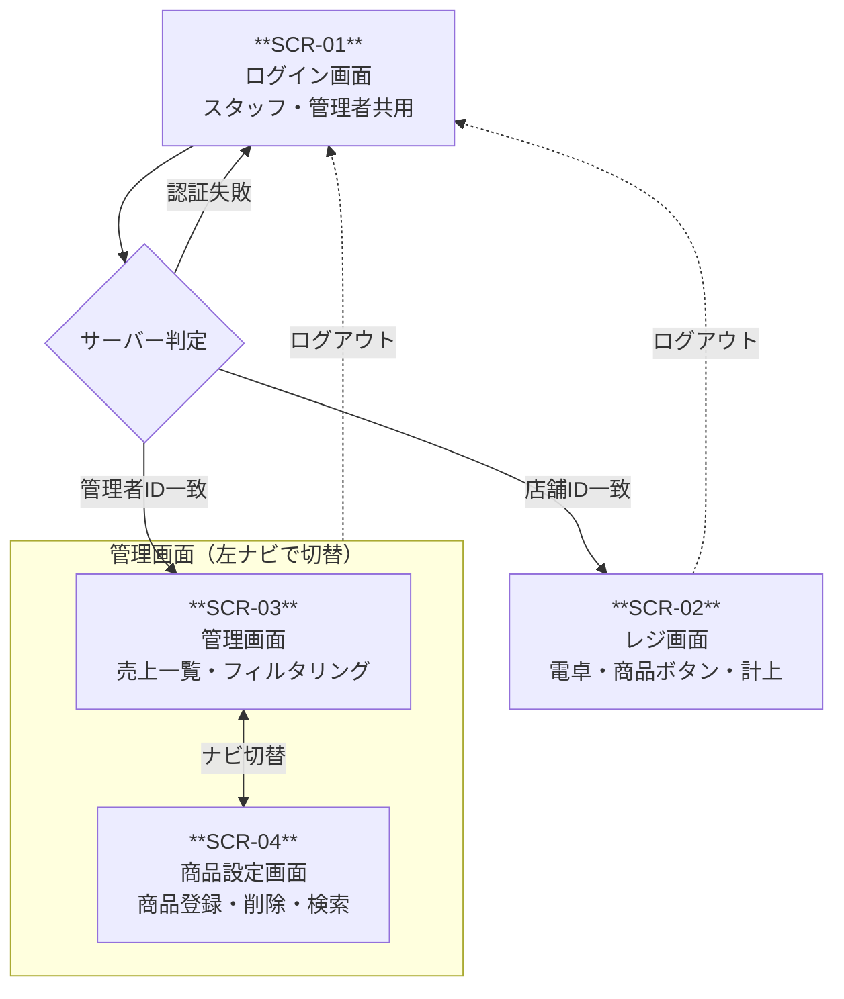
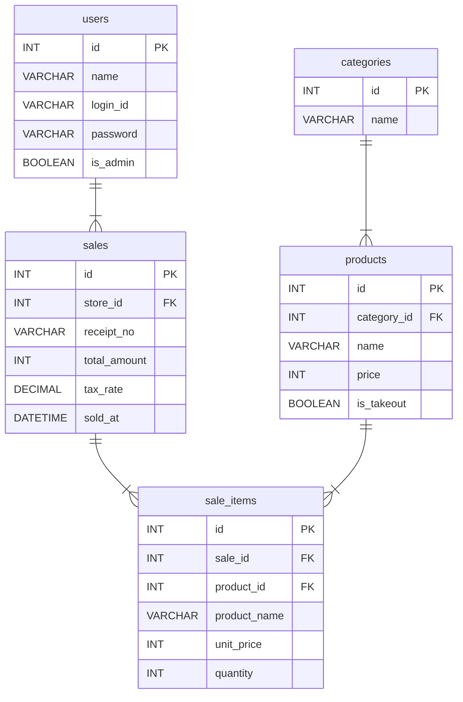

v2.0
**作成日：** 2026/04/24
**更新日：** 2026/06/05
**ステータス：** 確定（実装中に柔軟に変更）

> [!info] v2.0 変更概要（2026-06-05）  
> 技術スタックを PHP / MySQL / Apache から Next.js 16 / TypeScript / Drizzle ORM / Neon に移行。  
> ルーティング設計・ディレクトリ構成を App Router に対応して全面改訂。  
> 画面一覧・画面遷移・ER 図・テーブル定義はそのまま継続。

---

## 画面一覧整理

|画面ID|画面名|主な機能|遷移元|遷移先|優先度|
|:--|:--|:--|:--|:--|:--|
|**SCR-01**|ログイン画面|スタッフ用・管理者用ログインフォーム（店舗ID・PW or 管理ID・PW）|なし（エントリポイント）|SCR-02（スタッフログイン成功）<br>SCR-03（管理者ログイン成功）|P1|
|**SCR-02**|レジ画面|電卓操作・商品ボタン（カテゴリ別・TO/店内）・注文明細・お釣り計算・計上モーダル|SCR-01（スタッフログイン成功）|SCR-01（ログアウト）|P1|
|**SCR-03**|売上管理画面|売上一覧（店舗・カテゴリ・日付・会計番号で絞込）・絞込合計金額・絞込レコード数表示|SCR-01（ログイン成功）<br>SCR-04 ナビ|SCR-04（ナビ切替）<br>SCR-01（ログアウト）|P2|
|**SCR-04**|商品設定画面|商品登録フォーム（商品名・金額・カテゴリ・TO区分）／商品一覧（店舗・カテゴリでフィルタ・商品名検索）／削除|SCR-03 ナビ|SCR-03（ナビ切替）<br>SCR-01（ログアウト）|P1|

---

## 画面遷移図



---

## ルーティング設計

> [!info] **PHP との設計の違い**  
> PHP では画面表示（GET）とデータ処理（POST）がそれぞれ別ファイル・別 URL だった。  
> Next.js では画面表示は `page.tsx`、データ処理は **Server Actions**（TypeScript の関数）で行う。  
> Server Actions は独立した URL を持たないため、ルーティング表には画面（GET）のみを記載する。

| 画面ID   | 画面名      | URL               | 実装ファイル                                | 説明                     |
| :----- | :------- | :---------------- | :------------------------------------ | :--------------------- |
| SCR-01 | ログイン画面   | `/login`          | `app/(auth)/login/page.tsx`           | エントリポイント。未認証ユーザーはここに集約 |
| SCR-02 | レジ画面     | `/register`       | `app/(staff)/register/page.tsx`       | スタッフ用。未認証なら `/login` へ |
| SCR-03 | 管理画面（売上） | `/admin`          | `app/(admin)/admin/page.tsx`          | 管理者用。未認証なら `/login` へ  |
| SCR-04 | 商品設定画面   | `/admin/products` | `app/(admin)/admin/products/page.tsx` | 管理者用。SCR-03 と左ナビで切替    |
| -      | ルート      | `/`               | `app/page.tsx`                        | `/login` へリダイレクト       |

**Server Actions 一覧**（URL なし・TypeScript 関数として実装）

|処理|実装ファイル|関数名|PHP 版の対応ファイル|
|:--|:--|:--|:--|
|ログイン処理|`actions/auth.ts`|`login()`|`public/login.php`|
|ログアウト処理|`actions/auth.ts`|`logout()`|`public/logout.php`|
|計上処理|`actions/checkout.ts`|`checkout()`|`public/register/checkout.php`|
|商品登録処理|`actions/products.ts`|`createProduct()`|`public/admin/products/store.php`|
|商品削除処理|`actions/products.ts`|`deleteProduct()`|`public/admin/products/delete.php`|

**ルート保護**（認証ガード）

|対象パス|保護レベル|実装|
|:--|:--|:--|
|`/register/*`|スタッフセッション必須|`proxy.ts` + `app/(staff)/layout.tsx`|
|`/admin/*`|管理者セッション必須|`proxy.ts` + `app/(admin)/layout.tsx`|
|`/login`|認証済みなら `/register` or `/admin` へ|`proxy.ts`|

---

## ディレクトリ構成

```text
yse-pos-next/
│
├── app/                              # ルーティング（Next.js App Router）
│   ├── (auth)/                       # 認証関連ルートグループ（URL に影響しない）
│   │   └── login/
│   │       └── page.tsx             # SCR-01 /login
│   ├── (staff)/                      # スタッフ用ルートグループ
│   │   ├── layout.tsx               # スタッフセッション確認レイアウト
│   │   └── register/
│   │       └── page.tsx             # SCR-02 /register
│   ├── (admin)/                      # 管理者用ルートグループ
│   │   ├── layout.tsx               # 管理者セッション確認レイアウト
│   │   └── admin/
│   │       ├── page.tsx             # SCR-03 /admin
│   │       └── products/
│   │           └── page.tsx         # SCR-04 /admin/products
│   ├── layout.tsx                   # ルートレイアウト（HTML・body・フォント）
│   └── page.tsx                     # / → /login にリダイレクト
│
├── actions/                         # Server Actions（ミューテーション処理）
│   ├── auth.ts                      # login() / logout()
│   ├── products.ts                  # createProduct() / deleteProduct()
│   └── checkout.ts                  # checkout()（計上処理）
│
├── components/
│   ├── ui/                          # shadcn/ui（自動生成・直接編集しない）
│   ├── register/                    # レジ画面用コンポーネント
│   └── admin/                       # 管理画面用コンポーネント
│
├── lib/
│   ├── db/
│   │   ├── schema.ts                # Drizzle スキーマ（全テーブル定義・型の SSoT）
│   │   └── index.ts                 # Neon + Drizzle 接続
│   ├── auth.ts                      # Auth.js v5 設定（Credentials Provider）
│   └── validations.ts               # Zod スキーマ（全フォームのバリデーション定義）
│
├── proxy.ts                         # ルート保護（Next.js 16・PHP の .htaccess に相当）
├── drizzle.config.ts                # Drizzle Kit 設定（マイグレーション）
├── .env.local                       # 環境変数（Git 管理外）
└── .env.example                     # 環境変数のサンプル（Git 管理・値なし）
```

> **ルートグループ `(auth)` `(staff)` `(admin)` について**  
> カッコ付きのディレクトリはルートグループといい、URL パスには現れない。  
> `/app/(staff)/register/page.tsx` のルートは `/register` になる。  
> グループごとに `layout.tsx` を置くことで、認証ガードをグループ単位で管理できる。

---

## 概念設計

|エンティティ|属性|備考|
|:--|:--|:--|
|users|名前・ログインID・パスワード・ロール|認証用データ。店舗ごとに1アカウント + 管理者用のアカウント（ロールで分類）|
|**products**（商品）|商品名・価格・TO区分・カテゴリID|商品マスタ。1商品は1カテゴリに属する（1対多）|
|**categories**（カテゴリ）|カテゴリ名|表記ゆれ防止のため独立したテーブルで管理|
|**sales**（売上）|会計日時・合計金額・税率・伝票番号・店舗ID|1回の会計全体を表すヘッダー|
|**sale_items**（売上明細）|会計ID・商品ID・商品名・単価・個数|会計に含まれる商品ごとの明細行。商品名・単価は売上時点の値を保持|

> [!INFO] **2026-05-22**: 商品×カテゴリを **多対多 → 1対多** に簡略化（`product_categories` 中間テーブルを廃止）。要件定義書の概念設計では「商品は単一カテゴリに属する」前提だったため、概念設計に合わせて中間テーブルを廃止し、`products.category_id` に正規化した。中間テーブルは画面・運用上の必要性が確認できないまま実装の複雑度だけを上げるため。

> [!INFO] **2026-06-05（v2.0）**: Auth.js v5 の認証方式について。  
> Auth.js v5 には `DrizzleAdapter` があるが、本システムでは **使わない**。  
> 理由：Adapter を使うと Auth.js が期待する `email`・`emailVerified` 等のカラムが `users` テーブルに必要になるが、本システムは OAuth を使わず `login_id`（4桁数字）+ パスワードの Credentials 認証のみのため。  
> **採用方針：Credentials Provider + JWT セッション**。これにより `users` テーブルの構造変更は不要。

#### リレーションシップ

- カテゴリ 1対多 商品（1つのカテゴリは複数の商品を持つ／1商品は1カテゴリに属する）
- 店舗 1対多 売上（1つの店舗は複数の会計を持つ）
- 売上 1対多 売上明細（1つの会計は複数の明細行を持つ）
- 商品 1対多 売上明細（1つの商品は複数の会計明細に登場する）

---

## 論理設計（ERD）



---

## テーブルの制約・オプション

|テーブル名（エンティティ）|カラム名|設定されているオプション・制約|設定理由|
|:--|:--|:--|:--|
|users（ユーザーマスタ）|id|AUTO_INCREMENT|システムが自動で「被らない連番」を振り、管理の手間を無くすため。|
||name|NOT NULL|画面表示などで「誰が操作しているか」を必ず表示させる必要があるため。|
||login_id|NOT NULL, UNIQUE（**入力フォーマット：数字4桁**）|ログインに必須（NOT NULL）であり、同じIDの人が複数いると誰がログインしたか判別できなくなるため（UNIQUE）。フォーマットはスタッフが素早く打鍵できる数字4桁に統一。|
||password|NOT NULL（**入力フォーマット：数字4桁**）|認証システムにおいてパスワードなしでのログインを防ぐため。フォーマットはログインIDと同様の理由で数字4桁に統一（保存はハッシュ化）。|
||is_admin|DEFAULT FALSE|新しくユーザーを登録する際、基本は「一般スタッフ」として扱うのが安全なため。|
|categories（カテゴリマスタ）|id|AUTO_INCREMENT|（同上）システムが自動で連番を振るため。|
||name|NOT NULL|「名前のないカテゴリ」が登録されると、画面で選択・表示できなくなるため。|
|products（商品マスタ）|id|AUTO_INCREMENT|（同上）システムが自動で連番を振るため。|
||category_id|NOT NULL, FOREIGN KEY → categories(id)|1商品は必ず1カテゴリに属する設計（1対多）のため、未分類状態を許容しない。|
||name|NOT NULL|レジ画面やレシートに印字する際、必須の項目であるため。|
||price|NOT NULL|金額が空っぽ（0円ですらない状態）だと、売上計算の際にシステムエラーとなるため。|
||is_takeout|DEFAULT FALSE|基本を「店内飲食（テイクアウトではない＝FALSE）」とするため。|
|sales（売上）|id|AUTO_INCREMENT|（同上）システムが自動で連番を振るため。|
||store_id|NOT NULL|「どの店舗で売れたか」が不明な売上データを作らせないため。|
||receipt_no|NOT NULL|伝票番号はレシートとの照合に必ず必要になるため。|
||total_amount|NOT NULL|合計金額のない売上データはシステム上無意味であるため。|
||tax_rate|NOT NULL|軽減税率（8%・10%）の計算を正確に行うために必須であるため。|
||sold_at|NOT NULL|「いつ売れたか」が分からないと、日別の売上集計などができなくなるため。|
|sale_items（売上明細）|id|AUTO_INCREMENT|（同上）システムが自動で連番を振るため。|
||sale_id|NOT NULL|「どの会計の明細か」という紐付けに必須のため。|
||product_id|NOT NULL|「何が売れたか」という紐付けに必須のため。|
||product_name|NOT NULL|マスタの商品名が後から変更されても、当時の「売れた商品名」を正確に残すために必須の項目。|
||unit_price|NOT NULL|マスタの価格が後から変更されても、当時の「売れた金額」を正確に残すために必須の項目。|
||quantity|NOT NULL|「何個売れたか」がないと、合計金額の計算が成り立たないため。|

---

## 型選定の根拠

|カラム|PHP 版の型|Drizzle（PostgreSQL）の型|根拠|
|:--|:--|:--|:--|
|`price` `unit_price` `total_amount`|INT|`integer()`|金額は円単位の整数で管理。小数点以下はアプリ層で丸めてから保存し、計算誤差の蓄積を防ぐ|
|`tax_rate`|DECIMAL|`numeric()`|8%・10%の小数を正確に保持するため。`real()`（浮動小数）は2進数近似値のため税率には不使用|
|`receipt_no`|VARCHAR|`text()`|将来的に「2026-0042」のような文字列形式にも対応できる余地を残すため|
|`is_takeout` `is_admin`|BOOLEAN（TINYINT）|`boolean()`|2値で表現できる。PostgreSQL はネイティブの boolean 型を持つ|
|`product_name` `unit_price`（sale_items）|VARCHAR / INT|`text()` / `integer()`|売上時点の商品名・価格を記録として固定する。商品マスタの変更が過去の売上に影響しないよう保証するため|
|`sold_at`|DATETIME|`timestamp()`|PostgreSQL の timestamp 型。タイムゾーンが必要な場合は `timestamptz()` に変更を検討|

---

## 技術スタック

|項目|内容|
|:--|:--|
|フレームワーク|Next.js 16 (App Router)|
|言語|TypeScript|
|フロントエンド|React / Tailwind CSS v4 / shadcn/ui|
|ORM|Drizzle ORM|
|データベース|PostgreSQL（Neon）|
|認証|Auth.js v5（Credentials Provider + JWT セッション）|
|バリデーション|Zod|
|パッケージ管理|pnpm|
|デプロイ|Vercel|
|開発環境|VS Code|
|動作ブラウザ|Google Chrome（最新版）のみ|